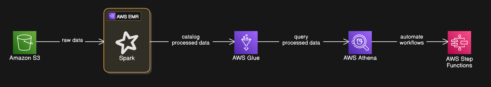
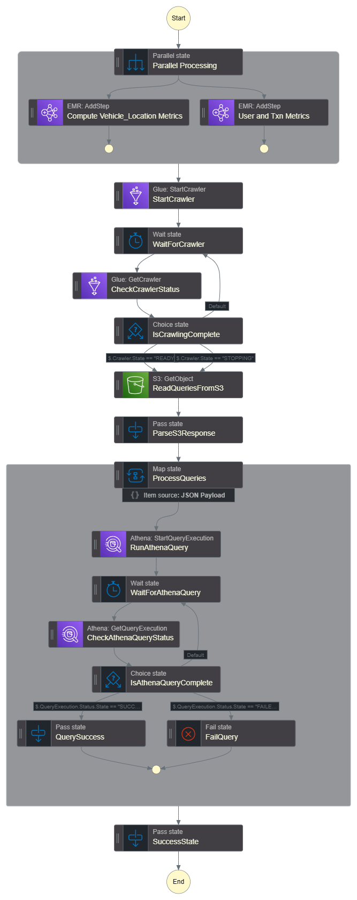

# Big Data Processing with AWS EMR

## Overview

This project demonstrates how to process big data using AWS EMR (Elastic MapReduce). It involves working with a car rental marketplace dataset and leveraging Spark on EMR to process and transform raw data stored in Amazon S3. Additional AWS services such as Glue, Athena, and Step Functions are integrated to create a fully automated data pipeline.

## Objectives

By the end of this project, you will be able to:

- Understand AWS EMR and its role in big data processing.
- Process raw data from S3 using Spark on EMR.
- Transform datasets to derive key business metrics.
- Use AWS Glue Crawlers and Athena for data analysis.
- Automate data workflows with AWS Step Functions.

## Datasets

The project utilizes four datasets stored in Amazon S3:

1. **Vehicles Dataset** - Contains all available rental vehicles.
2. **Users Dataset** - Contains user sign-up information.
3. **Locations Dataset** - Contains master data for all rental locations.
4. **Rental Transactions Dataset** - Includes rental records with details like:
   - Rental start and end time
   - Pickup and drop-off locations
   - Vehicle ID
   - Total amount paid

## Architecture

The pipeline architecture is as follows:

1. **Data Ingestion**: Raw data is stored in Amazon S3.
2. **Data Processing**: Spark jobs running on AWS EMR process the data.
3. **Data Cataloging**: AWS Glue Crawlers infer schemas and create a Glue Data Catalog.
4. **Data Analysis**: AWS Athena is used to query the processed data.
5. **Automation**: AWS Step Functions orchestrate the entire workflow.

## Steps to Execute

### Step 1: Setting Up AWS EMR Cluster

- Launch an EMR cluster on AWS with Spark enabled.

### Step 2: Processing Data with Spark on EMR

Two Spark jobs are run to process and extract insights:

#### **Spark Job 1: Vehicle and Location Performance Metrics**

- Revenue per location
- Total transactions per location
- Average, max, and min transaction amounts
- Unique vehicles used at each location
- Rental duration and revenue by vehicle type

#### **Spark Job 2: User and Transaction Analysis**

- Total transactions per day
- Revenue per day
- User-specific spending and rental duration metrics
- Maximum and minimum transaction amounts

_The transformed data is stored back in S3 in Parquet format._

### Step 3: Creating AWS Glue Crawlers

- Configure AWS Glue Crawlers to infer schema and create a Glue Data Catalog.

### Step 4: Querying Data with Athena

- Use AWS Athena with SQL queries to analyze the processed data.
- Example queries:
  - Find the highest revenue-generating location.
  - Find the most rented vehicle type.
  - Identify top-spending users.

### Step 5: Automating the Pipeline with AWS Step Functions

To streamline the workflow, Step Functions automate the process:

1. Spin up an EMR cluster.
2. Run Spark jobs to process data.
3. Trigger AWS Glue Crawlers post-processing.
4. Query processed data in Athena.
5. Terminate the EMR cluster after job completion.

## Key Performance Indicators (KPIs)

### **Location and Vehicle Performance:**

- Total revenue per location
- Total transactions per location
- Average, max, and min transaction amounts per location
- Unique vehicles used per location
- Rental duration metrics by vehicle type

### **User and Transaction Metrics:**

- Total daily transactions and revenue
- Average transaction value
- User engagement metrics (total transactions, total revenue per user)
- Maximum and minimum spending per user
- Total rental hours per user

## Codebase Overview

### **Spark Jobs**

- **[`spark-job-1.py`](scripts/spark-job-1.py)**: Processes vehicle and location performance metrics.
- **[`spark-job-2.py`](scripts/spark-job-2.py)**: Processes user and transaction analysis.

### **Step Functions**

- **[`step_function_code.json`](step_function_code.json)**: Defines the Step Functions workflow for automating the pipeline.

### **SQL Queries**

- Example Athena queries for analysis:
  - Find the highest revenue-generating location.
  - Find the most rented vehicle type.
  - Identify top-spending users.

### **Assets**

- **Architecture Diagram**: `assets/architecture_diagram.png`
- **Pipeline Workflow**: `assets/pipeline_workflow.png`

## Evaluation Criteria

- **Correct implementation** of the ETL pipeline.
- **Proper data validation** and error handling.
- **Efficient computation** of KPIs and storage in S3.
- **Code readability, efficiency, and adherence to best practices.**
- **Well-structured documentation** for ease of use and troubleshooting.

## Setup Instructions

1. Clone this repository.
2. Configure AWS credentials.
3. Follow the step-by-step execution guide outlined above.

## Contributing

Contributions are welcome! Please fork the repository and submit a pull request with any improvements.

## License

This project is licensed under the MIT License - see the LICENSE file for details.
